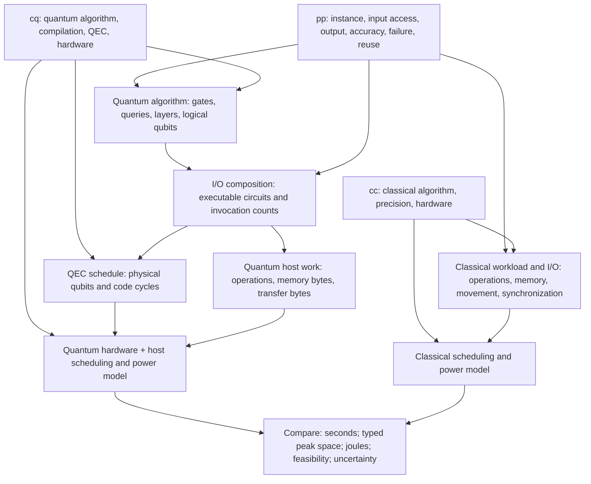

# Proposed manuscript section: A reusable comparison framework

Our organizing contribution is a modular framework for comparing the time, space, and operational energy required to deliver the same computational output on quantum and classical systems. Linear-system solvers provide case studies: algorithmic improvements, error-correction strategies, and hardware assumptions can be changed independently through explicit resource interfaces. The framework produces conditional resource estimates and feasibility regions; it does not by itself establish practical quantum advantage.

Let `pp` describe the computational task, including the input instance or instance family, representation and initial location of data, requested output, accuracy criterion, permitted failure probability, and reuse workload. For a linear system, `pp` includes the dimension N, matrix class, maximum row and column sparsities, condition number in a specified norm, scaling, right-hand side, and output functional. No relation such as κ = s = log₂ N is implicit. The mathematical solution x = A⁻¹b, its normalized quantum encoding |x⟩, and a classical estimate of a functional f(x) are distinct outputs. HHL's original formulation explicitly considers extracting an observable associated with the solution [R1](https://arxiv.org/abs/0811.3171v3). Comparisons therefore specify one output contract shared by both methods, including any normalization recovery.

The configurations `cq` and `cc` specify quantum and classical algorithm choices, preprocessing, precision, parallelism, hardware, and resource limits. Quantum configuration additionally specifies compilation, error correction, distillation, and control. Algorithm selection belongs to configuration; the original physical problem belongs to `pp`. A preconditioned or embedded operator has separately named dimensions, sparsity, conditioning, and normalization in the selected algorithm's configuration, together with its construction cost and recovery map to the original output.

Define the maps

\[
 L_q=\mathcal A_q(pp,cq_{\rm alg}),\quad
 W_q=\mathcal I_q(pp,cq_{\rm io},L_q),\quad
 P_q=\mathcal Q(W_q,cq_{\rm compile},cq_{\rm qec},cq_{\rm hw}),
\]
\[
 W_c=\mathcal I_c(pp,cc_{\rm io},\mathcal A_c(pp,cc_{\rm alg})),\qquad
 F_q(pp,cq)=\mathcal H_q(P_q,W_q^{\rm host},cq_{\rm hw}),\quad
 F_c(pp,cc)=\mathcal H_c(W_c,cc_{\rm hw}).
\]

Each F returns `(time_s, space, energy_J, feasibility, uncertainty)`. Space is a typed vector: peak logical/physical qubits, peak host/device memory bytes, and other capacity limits as appropriate. Qubits and bytes are never added or divided to claim a space advantage. A common footprint comparison would require a separately justified mapping to, for example, installation area.

The logical algorithm interface reports gate counts in a declared exclusive basis, oracle queries, circuit and non-Clifford depth, and peak simultaneous logical qubits per invocation. The input/output adapter adds executable state preparation, oracle implementation, measurements, reset, repetitions, and host processing. Merely placing state preparation inside a circuit does not eliminate its cost. Oracle queries remain diagnostic once their implementation has been expanded into gates. Repeated invocations contribute work and time; they increase peak space only when execution overlaps. The QEC adapter schedules the resulting workload and reports physical-qubit occupancy and syndrome-extraction cycle counts, including routing, factories, storage, and stalls. Surface-code architectures permit different space/time tradeoffs [R2](https://arxiv.org/abs/1808.02892v3); a T count alone is insufficient to fix runtime without scheduling assumptions.

The classical algorithm interface reports operation counts by precision and kind, memory capacity, bytes moved across named interfaces, and synchronization. The hardware adapter converts these to time using measured performance or explicitly labeled performance models. Processor frequency is not a floating-point throughput. Compute and bandwidth ceilings constrain attainable performance [R3](https://amcr.lbl.gov/departments/computer-science-department/ppan/roofline-performance-model/); a roofline lower bound is not a measured runtime. Overlap is evaluated using an execution schedule, so independent durations are not automatically summed or assumed perfectly hidden.

Operational energy is the integral of attributed electrical power over the same scheduled execution window. The declared boundary includes quantum cooling, controls, decoding and host systems, or classical compute, memory and networking, together with consistently attributed facility overhead. A fitted coefficient in W/physical-qubit is power, not energy per qubit, and is a scenario parameter rather than a universal constant. Energy already measured at a facility boundary receives no additional cooling or facility multiplier. Embodied energy is outside this operational metric and must be reported separately if studied.

Both methods deliver an output satisfying
\[
 \Pr\{d_{\rm out}(\widehat y,f(x))\leq\epsilon_{\rm out}\}\geq1-\delta_{\rm total}.
\]
Accuracy components are converted to the output metric before aggregation; failure probabilities are budgeted separately. Setup costs are charged once per valid reuse group. For B sequential outputs sharing one setup, amortized time and energy are `(setup + sum of per-output costs)/B`; batch latency and first-output latency are reported separately. Memory is not amortized. The same workload and data availability apply to both methods, although valid algorithm-specific reuse can differ.

Finally, uncertainty is propagated through the entire pipeline, including re-selection of feasible discrete QEC configurations when allowed by the declared optimization policy. Comparisons state hardware scenarios, equal output criteria, energy boundaries, and whether resource estimates are expected costs or deadline guarantees. A time or energy crossover is reported only where both configurations are feasible and the applicable uncertainty supports that conclusion.

## Diagram specification

Place this workflow before the HHL case study. Boxes are interfaces, arrows are versioned contracts. Label every edge with units; draw the quantum host path around QEC, joining at the hardware scheduler. A shared band above the diagram holds output accuracy, failure budgets, input availability, reuse, uncertainty and provenance. A lower band states boundary and feasibility checks. No numerical crossover belongs in this diagram.

Suggested caption: “A reusable comparison workflow. Each branch starts from the same input and requested output. Input preparation, output extraction, repetition, host processing, fault tolerance, and physical operation are explicitly accounted for. Predictions are conditional on declared hardware, scheduling, accuracy, reuse, and energy boundaries; no data-access cost is assumed free.”

## Illustrative symbolic calculation (no numerical prediction)

Consider a normalized Hermitian observable with outcomes in [−1,1], estimated from M independent accepted solution states. The target is μ = ⟨x|O|x⟩ for normalized |x⟩. Let the trace distance between each prepared state and the ideal state be at most η. Then observable bias is at most 2η. Choose `2η + ε_stat ≤ ε_out`. A sample mean satisfies the Hoeffding guarantee if

\[
 M\geq\left\lceil2\epsilon_{\rm stat}^{-2}\log(2/\delta_{\rm stat})\right\rceil.
\]

This bound follows by inserting interval width 2 in the bounded-variable Hoeffding inequality [R4](https://doi.org/10.1080/01621459.1963.10500830); it assumes independent accepted samples and an implementation of the specified observable measurement. It does not apply unchanged to general classical shadows or coherent amplitude estimation.

Suppose each independent trial succeeds with probability p > 0. A trial resets and prepares the input, runs the core solver and measures the herald (including ancilla cleanup), with gate vector `g_try = g_prep + g_core + g_herald`. Core counts here exclude all three external retry and readout multipliers. Successful trials additionally execute `g_obs`, including the measurement basis change and reset. The expected number of trials is M/p, giving

\[
 \mathbb E[\mathbf G]=\frac Mp\mathbf g_{\rm try}+M\mathbf g_{\rm obs}.
\]

For a deadline claim, choose a fixed attempt cap K with `Pr[Binomial(K,p) < M] ≤ δ_retry`; stop after M successes or K trials. The uncapped expectation above is an upper bound on the capped expected trial count, not its exact expectation. An upper-bound schedule reserves K trials and M successful readouts. Choose QEC budgets over that capped schedule such that

\[
 \delta_{\rm stat}+\delta_{\rm retry}+\delta_{\rm qec}+\delta_{\rm other}\leq\delta_{\rm total}.
\]

If the QEC adapter returns `c_try` and `c_obs` syndrome cycles per serialized operation, including all stalls, and hardware cycle duration is τ_cyc seconds/cycle, the reserved quantum-device time is `τ_cyc(K c_try + M c_obs)`. With serialized, separately charged setup and host work,

\[
 t_q^{\rm ub}=t_{q,\rm setup}+\tau_{\rm cyc}(Kc_{\rm try}+Mc_{\rm obs})+t_{q,\rm host}.
\]

For a classical algorithm computing the same μ, let k iterations cost F_it arithmetic operations and V_it bytes at one specified memory interface. In a deliberately serialized compute/transfer model with sustained rates f_eff operations/s and b_eff bytes/s,

\[
 t_c=t_{c,\rm setup}+k(F_{\rm it}/f_{\rm eff}+V_{\rm it}/b_{\rm eff})+t_{c,\rm output}.
\]

If overlap is possible, `max(k F_it/f_eff, k V_it/b_eff)` is a useful idealized phase estimate only under stated utilization and scheduling assumptions; it does not automatically replace a measured runtime. Assume constant, mutually exclusive attributed powers P_q and P_c during the compared run windows: `E_q = E_q,setup + P_q t_q,run` and `E_c = E_c,setup + P_c t_c,run`. Setup energy is not included again in the run windows. These formulas illustrate dimensional and ownership rules, and imply no speedup or energy advantage.

The accompanying symbolic JSON expresses the capped quantum schedule. Its parameters are uninstantiated; its status cannot be used as a numerical result.
